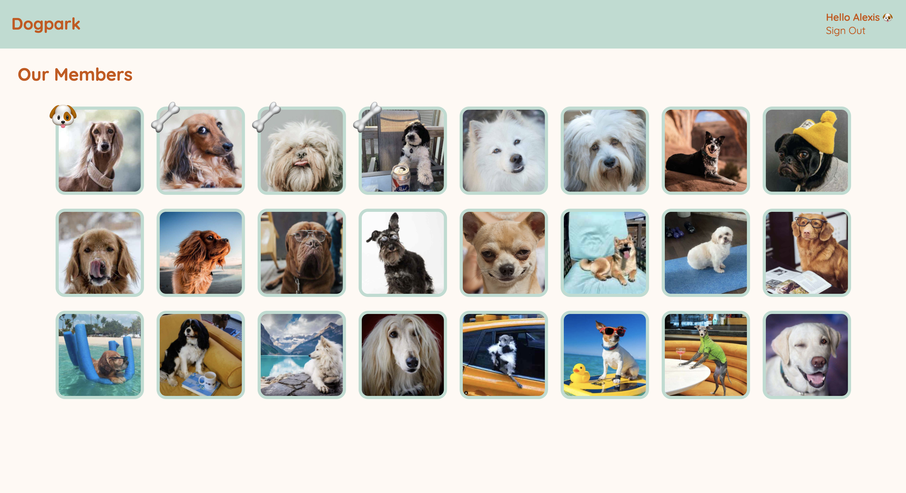
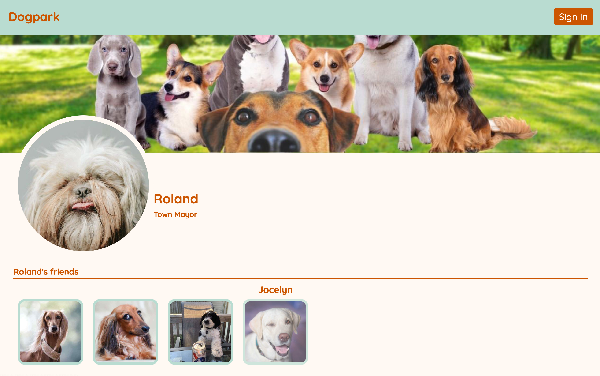
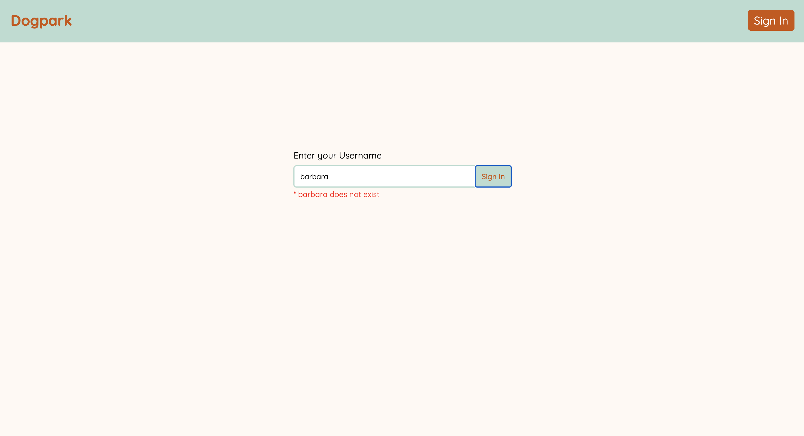

# 🦴 Dogpark: A Social Network For Dogs

Welcome to Dogpark. A fictionalized social media for our furry friends that bark.

---

This project was built with **React**, **Javascript**, **Node.js**, **Express** and styled with **Styled-Components**.

---

## Screenshots

## Setup

This repository contains a frontend and a backend folder. This means that each folder is a complete environment (`package.json`, `/node_modules`). They are completely independent. You cannot reference code from one environment in the other environment.

### The Frontend

1. Open a terminal in VS Code
2. Type `cd frontend`
3. Type `yarn install`

Use `yarn dev:frontend` to start the frontend dev environment.

### The Backend

1. Open _another_ terminal in VS Code
2. Type `cd backend`
3. Type `yarn install`

Use `yarn dev:backend` to start the backend dev environment.

Once your all set up head over to http://localhost:3000/ in your browser to view the project.

## What has been implemented in this project

- Users can sign in with their username (which is their name).
- Once signed in, the member can see all the members. Those with a dogbone assigned indicates that the dog is part of their friend list.
- The user can click on the other member's picture to view their profile along with their current friends.
- User can click on the logo to return home.
- Once finished with their social media session, the user can sign out.
